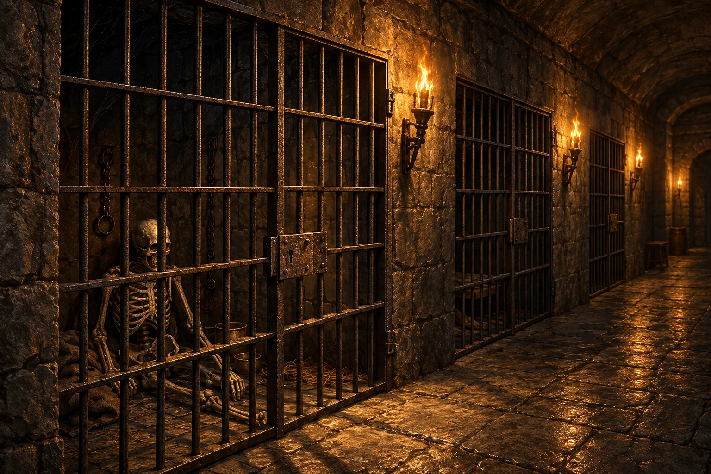
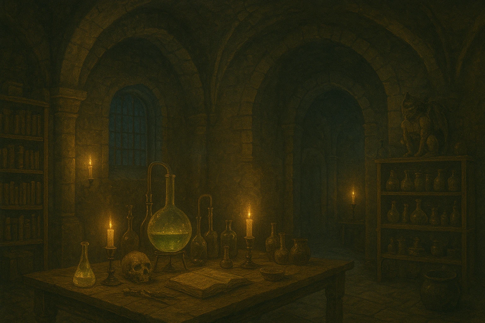
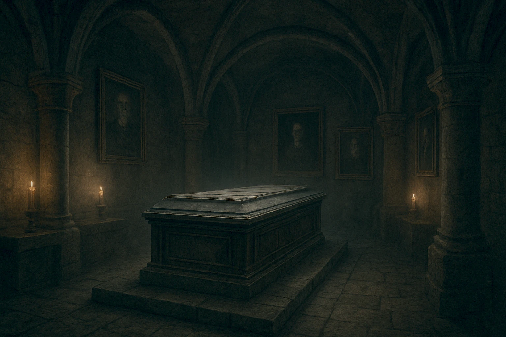

# Vampyrgrevens Borg

## Billeder til Vampyrgrevens Borg

<h2>Borg</h2>
 
<a href="borg.webp" download>⬇️ Download borg.webp</a>

<h2>Tronsal</h2>
 
<a href="tronsal.webp" download>⬇️ Download tronsal.webp</a>

<h2>Vagtstue</h2>
 
<a href="vagtstue.webp" download>⬇️ Download vagtstue.webp</a>

<h2>Fængsel</h2>
 
<a href="faengsel.webp" download>⬇️ Download faengsel.webp</a>

<h2>Laboratorium</h2>
 
<a href="laboratorium.webp" download>⬇️ Download laboratorium.webp</a>

<h2>Gravkammer</h2>
 
<a href="gravkammer.webp" download>⬇️ Download gravkammer.webp</a>

<h2>Blodløs tjener</h2>
 
<a href="blodloes_tjener.webp" download>⬇️ Download blodloes_tjener.webp</a>

<h2>Varholm</h2>
 
<a href="varholm.webp" download>⬇️ Download varholm.webp</a>
