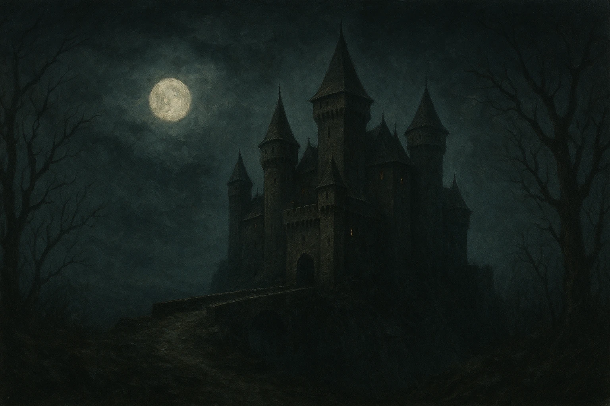
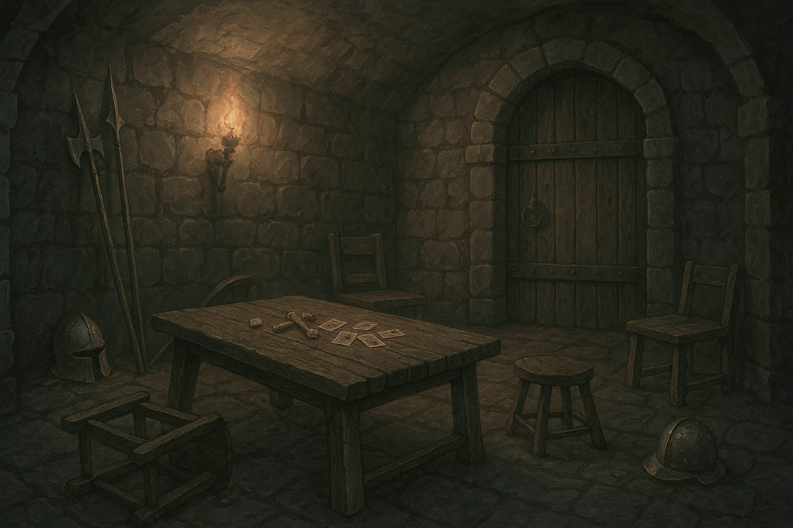

# Billeder 1

<h2>Borg</h2>
 
<a href="borg.webp" download>⬇️ Download borg.webp</a>

<h2>Tronsal</h2>
 
<a href="tronsal.webp" download>⬇️ Download tronsal.webp</a>

<h2>Vagtstue</h2>
 
<a href="vagtstue.webp" download>⬇️ Download vagtstue.webp</a>
